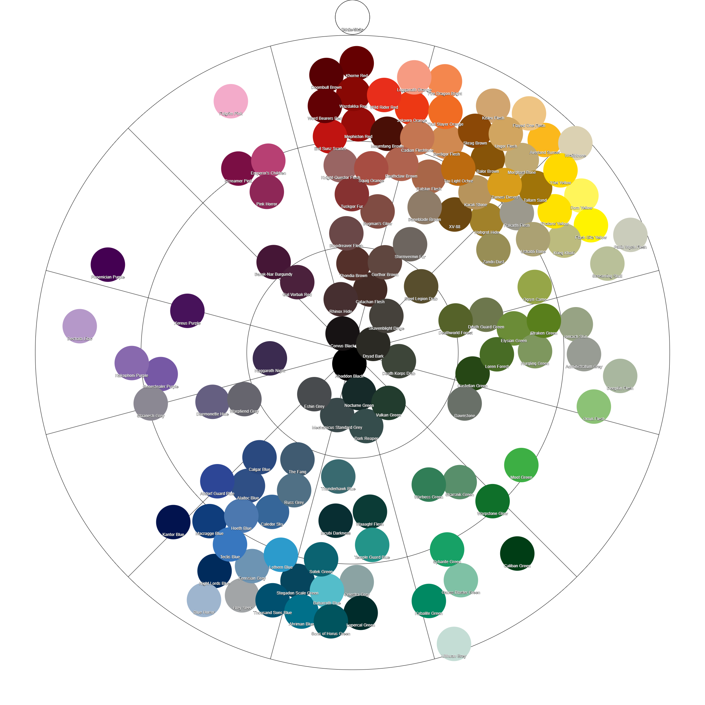

# Citadel Colour Tables and Tools

This repo contains several tables and tools listing Citadel Colours:
- [Official Citadel Colours Table](tables/citadel_official_colors_table.md)
- [Sampled Citadel Colours Table](tables/citadel_colors_sampled.md)
- Closest color finder [script](scripts/finder.py)
- Color wheels

> [!WARNING]
> GitHub flavored Markdown strips html styles, including the `
` used to display preview of colors and gradients in the tables. You'll need to download the files to preview them.