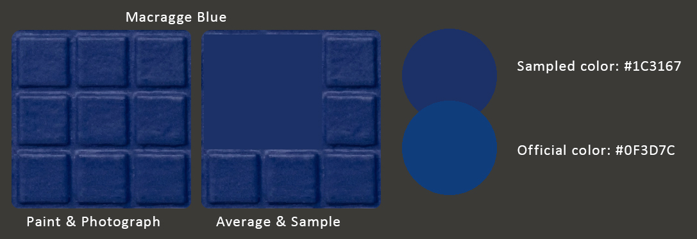

# Citadel Colours Sampled Values

The table below lists all **128 Citadel Colour base and layer non-metallic paints**, with their official name and color.  
The color is provided as `HEX`, `RGB`, `HSL` and `CMYK`.  
The provided color values are <u>more accurate than the official ones</u>. Each color is **painted, photographed, averaged and sampled**.
The resulting color values, while still an approximation, are <u>closer to the real deal than the ones provided on the Citadel marketing material</u>.
See the example for Macragge Blue to see the difference between the color provided here and the official one, and how much closer the ones here are.

Support the swatch creator [Tale of Painters](https://www.patreon.com/c/stahlytaleofpainters/shop) if you wish to purchase the original swatches. This is just a derived work.

| Name                     | Color                                                | HEX       | RGB                  | HSL                   | CMYK                       |
| ----                     | -----                                                | ---       | ---                  | ---                   | ----                       |
| Rhinox Hide              | 
 | `#211413` | `rgb(33, 20, 19)`    | `hsl(4, 27%, 10%)`    | `cmyk(0%, 39%, 42%, 87%)`  |
| Thondia Brown            | 
 | `#31241F` | `rgb(49, 36, 31)`    | `hsl(17, 23%, 16%)`   | `cmyk(0%, 27%, 37%, 81%)`  |
| Catachan Flesh           | 
 | `#382621` | `rgb(56, 38, 33)`    | `hsl(13, 26%, 17%)`   | `cmyk(0%, 32%, 41%, 78%)`  |
| Dryad Bark               | 
 | `#332827` | `rgb(51, 40, 39)`    | `hsl(5, 13%, 18%)`    | `cmyk(0%, 22%, 24%, 80%)`  |
| Doombull Brown           | 
 | `#461B15` | `rgb(70, 27, 21)`    | `hsl(7, 54%, 18%)`    | `cmyk(0%, 61%, 70%, 73%)`  |
| Mournfang Brown          | 
 | `#523322` | `rgb(82, 51, 34)`    | `hsl(21, 41%, 23%)`   | `cmyk(0%, 38%, 59%, 68%)`  |
| Bloodreaver Flesh        | 
 | `#4F2F2B` | `rgb(79, 47, 43)`    | `hsl(7, 30%, 24%)`    | `cmyk(0%, 41%, 46%, 69%)`  |
| Word Bearers Red         | 
 | `#672220` | `rgb(103, 34, 32)`   | `hsl(2, 53%, 26%)`    | `cmyk(0%, 67%, 69%, 60%)`  |
| Gorthor Brown            | 
 | `#593D36` | `rgb(89, 61, 54)`    | `hsl(12, 24%, 28%)`   | `cmyk(0%, 31%, 39%, 65%)`  |
| Steel Legion Drab        | 
 | `#675241` | `rgb(103, 82, 65)`   | `hsl(27, 23%, 33%)`   | `cmyk(0%, 20%, 37%, 60%)`  |
| XV-88                    | 
 | `#745438` | `rgb(116, 84, 56)`   | `hsl(28, 35%, 34%)`   | `cmyk(0%, 28%, 52%, 55%)`  |
| Skrag Brown              | 
 | `#884126` | `rgb(136, 65, 38)`   | `hsl(17, 56%, 34%)`   | `cmyk(0%, 52%, 72%, 47%)`  |
| Knight-Questor Flesh     | 
 | `#6F4942` | `rgb(111, 73, 66)`   | `hsl(9, 25%, 35%)`    | `cmyk(0%, 34%, 41%, 56%)`  |
| Mephiston Red            | 
 | `#912724` | `rgb(145, 39, 36)`   | `hsl(2, 60%, 35%)`    | `cmyk(0%, 73%, 75%, 43%)`  |
| Balor Brown              | 
 | `#966326` | `rgb(150, 99, 38)`   | `hsl(33, 60%, 37%)`   | `cmyk(0%, 34%, 75%, 41%)`  |
| Tuskgor Fur              | 
 | `#8D4338` | `rgb(141, 67, 56)`   | `hsl(8, 43%, 39%)`    | `cmyk(0%, 52%, 60%, 45%)`  |
| Baneblade Brown          | 
 | `#736153` | `rgb(115, 97, 83)`   | `hsl(26, 16%, 39%)`   | `cmyk(0%, 16%, 28%, 55%)`  |
| Tallarn Sand             | 
 | `#836B4C` | `rgb(131, 107, 76)`  | `hsl(34, 27%, 41%)`   | `cmyk(0%, 18%, 42%, 49%)`  |
| Deathclaw Brown          | 
 | `#9F5435` | `rgb(159, 84, 53)`   | `hsl(18, 50%, 42%)`   | `cmyk(0%, 47%, 67%, 38%)`  |
| Bugman's Glow            | 
 | `#855751` | `rgb(133, 87, 81)`   | `hsl(7, 24%, 42%)`    | `cmyk(0%, 35%, 39%, 48%)`  |
| Ratskin Flesh            | 
 | `#AF5C3C` | `rgb(175, 92, 60)`   | `hsl(17, 49%, 46%)`   | `cmyk(0%, 47%, 66%, 31%)`  |
| Zamesi Desert            | 
 | `#B08047` | `rgb(176, 128, 71)`  | `hsl(33, 43%, 48%)`   | `cmyk(0%, 27%, 60%, 31%)`  |
| Jokaero Orange           | 
 | `#BA613F` | `rgb(186, 97, 63)`   | `hsl(17, 49%, 49%)`   | `cmyk(0%, 48%, 66%, 27%)`  |
| Zandri Dust              | 
 | `#9A7D60` | `rgb(154, 125, 96)`  | `hsl(30, 23%, 49%)`   | `cmyk(0%, 19%, 38%, 40%)`  |
| Averland Sunset          | 
 | `#C58336` | `rgb(197, 131, 54)`  | `hsl(32, 57%, 49%)`   | `cmyk(0%, 34%, 73%, 23%)`  |
| Karak Stone              | 
 | `#937E69` | `rgb(147, 126, 105)` | `hsl(30, 17%, 49%)`   | `cmyk(0%, 14%, 29%, 42%)`  |
| Squig Orange             | 
 | `#B2544A` | `rgb(178, 84, 74)`   | `hsl(6, 41%, 49%)`    | `cmyk(0%, 53%, 58%, 30%)`  |
| Troll Slayer Orange      | 
 | `#E6491B` | `rgb(230, 73, 27)`   | `hsl(14, 80%, 50%)`   | `cmyk(0%, 68%, 88%, 10%)`  |
| Cadian Fleshtone         | 
 | `#A86C5A` | `rgb(168, 108, 90)`  | `hsl(14, 31%, 51%)`   | `cmyk(0%, 36%, 46%, 34%)`  |
| Rakarth Flesh            | 
 | `#917F76` | `rgb(145, 127, 118)` | `hsl(20, 11%, 52%)`   | `cmyk(0%, 12%, 19%, 43%)`  |
| Tau Light Ochre          | 
 | `#C57D49` | `rgb(197, 125, 73)`  | `hsl(25, 52%, 53%)`   | `cmyk(0%, 37%, 63%, 23%)`  |
| Bestigor Flesh           | 
 | `#D4793F` | `rgb(212, 121, 63)`  | `hsl(23, 63%, 54%)`   | `cmyk(0%, 43%, 70%, 17%)`  |
| Wild Rider Red           | 
 | `#E03F39` | `rgb(224, 63, 57)`   | `hsl(2, 73%, 55%)`    | `cmyk(0%, 72%, 75%, 12%)`  |
| Fire Dragon Bright       | 
 | `#F36C2B` | `rgb(243, 108, 43)`  | `hsl(20, 89%, 56%)`   | `cmyk(0%, 56%, 82%, 5%)`   |
| Ungor Flesh              | 
 | `#DD9552` | `rgb(221, 149, 82)`  | `hsl(29, 67%, 59%)`   | `cmyk(0%, 33%, 63%, 13%)`  |
| Kislev Flesh             | 
 | `#C6906D` | `rgb(198, 144, 109)` | `hsl(24, 44%, 60%)`   | `cmyk(0%, 27%, 45%, 22%)`  |
| Morghast Bone            | 
 | `#BA9F81` | `rgb(186, 159, 129)` | `hsl(32, 29%, 62%)`   | `cmyk(0%, 15%, 31%, 27%)`  |
| Lugganath Orange         | 
 | `#F69069` | `rgb(246, 144, 105)` | `hsl(17, 89%, 69%)`   | `cmyk(0%, 41%, 57%, 4%)`   |
| Flayed One Flesh         | 
 | `#CFB697` | `rgb(207, 182, 151)` | `hsl(33, 37%, 70%)`   | `cmyk(0%, 12%, 27%, 19%)`  |
| Wraithbone               | 
 | `#C9BEAE` | `rgb(201, 190, 174)` | `hsl(36, 20%, 74%)`   | `cmyk(0%, 5%, 13%, 21%)`   |
| Pallid Wych Flesh        | 
 | `#D2C4BD` | `rgb(210, 196, 189)` | `hsl(20, 19%, 78%)`   | `cmyk(0%, 7%, 10%, 18%)`   |
| Death Korps Drab         | 
 | `#292924` | `rgb(41, 41, 36)`    | `hsl(60, 6%, 15%)`    | `cmyk(0%, 0%, 12%, 84%)`   |
| Castellan Green          | 
 | `#313324` | `rgb(49, 51, 36)`    | `hsl(68, 17%, 17%)`   | `cmyk(4%, 0%, 29%, 80%)`   |
| Deathworld Forest        | 
 | `#4D492E` | `rgb(77, 73, 46)`    | `hsl(52, 25%, 24%)`   | `cmyk(0%, 5%, 40%, 70%)`   |
| Elysian Green            | 
 | `#6A6932` | `rgb(106, 105, 50)`  | `hsl(59, 36%, 31%)`   | `cmyk(0%, 1%, 53%, 58%)`   |
| Stormvermin Fur          | 
 | `#555450` | `rgb(85, 84, 80)`    | `hsl(48, 3%, 32%)`    | `cmyk(0%, 1%, 6%, 67%)`    |
| Death Guard Green        | 
 | `#646447` | `rgb(100, 100, 71)`  | `hsl(60, 17%, 34%)`   | `cmyk(0%, 0%, 29%, 61%)`   |
| Straken Green            | 
 | `#656A48` | `rgb(101, 106, 72)`  | `hsl(69, 19%, 35%)`   | `cmyk(5%, 0%, 32%, 58%)`   |
| Hobgrot Hide             | 
 | `#977848` | `rgb(151, 120, 72)`  | `hsl(36, 35%, 44%)`   | `cmyk(0%, 21%, 52%, 41%)`  |
| Nurgling Green           | 
 | `#82885A` | `rgb(130, 136, 90)`  | `hsl(68, 20%, 44%)`   | `cmyk(4%, 0%, 34%, 47%)`   |
| Ogryn Camo               | 
 | `#9D8F57` | `rgb(157, 143, 87)`  | `hsl(48, 29%, 48%)`   | `cmyk(0%, 9%, 45%, 38%)`   |
| Flash Gitz Yellow        | 
 | `#F4B809` | `rgb(244, 184, 9)`   | `hsl(45, 93%, 50%)`   | `cmyk(0%, 25%, 96%, 4%)`   |
| Yriel Yellow             | 
 | `#F3A014` | `rgb(243, 160, 20)`  | `hsl(38, 90%, 52%)`   | `cmyk(0%, 34%, 92%, 5%)`   |
| Phalanx Yellow           | 
 | `#F6D026` | `rgb(246, 208, 38)`  | `hsl(49, 92%, 56%)`   | `cmyk(0%, 15%, 85%, 4%)`   |
| Ionrach Skin             | 
 | `#9F9D82` | `rgb(159, 157, 130)` | `hsl(56, 13%, 57%)`   | `cmyk(0%, 1%, 18%, 38%)`   |
| Krieg Khaki              | 
 | `#ADA879` | `rgb(173, 168, 121)` | `hsl(54, 24%, 58%)`   | `cmyk(0%, 3%, 30%, 32%)`   |
| Ushabti Bone             | 
 | `#BFA781` | `rgb(191, 167, 129)` | `hsl(37, 33%, 63%)`   | `cmyk(0%, 13%, 32%, 25%)`  |
| Screaming Skull          | 
 | `#D1BE9F` | `rgb(209, 190, 159)` | `hsl(37, 35%, 72%)`   | `cmyk(0%, 9%, 24%, 18%)`   |
| Dorn Yellow              | 
 | `#F1D985` | `rgb(241, 217, 133)` | `hsl(47, 79%, 73%)`   | `cmyk(0%, 10%, 45%, 5%)`   |
| Loren Forest             | 
 | `#414B33` | `rgb(65, 75, 51)`    | `hsl(85, 19%, 25%)`   | `cmyk(13%, 0%, 32%, 71%)`  |
| Moot Green               | 
 | `#5D9A32` | `rgb(93, 154, 50)`   | `hsl(95, 51%, 40%)`   | `cmyk(40%, 0%, 68%, 40%)`  |
| Orruk Flesh              | 
 | `#7B874E` | `rgb(123, 135, 78)`  | `hsl(73, 27%, 42%)`   | `cmyk(9%, 0%, 42%, 47%)`   |
| Skarsnik Green           | 
 | `#749357` | `rgb(116, 147, 87)`  | `hsl(91, 26%, 46%)`   | `cmyk(21%, 0%, 41%, 42%)`  |
| Deepkin Flesh            | 
 | `#B6BAAB` | `rgb(182, 186, 171)` | `hsl(76, 10%, 70%)`   | `cmyk(2%, 0%, 8%, 27%)`    |
| Vulkan Green             | 
 | `#232F26` | `rgb(35, 47, 38)`    | `hsl(135, 15%, 16%)`  | `cmyk(26%, 0%, 19%, 82%)`  |
| Warboss Green            | 
 | `#476B43` | `rgb(71, 107, 67)`   | `hsl(114, 23%, 34%)`  | `cmyk(34%, 0%, 37%, 58%)`  |
| Nocturne Green           | 
 | `#1C2121` | `rgb(28, 33, 33)`    | `hsl(180, 8%, 12%)`   | `cmyk(15%, 0%, 0%, 87%)`   |
| Caliban Green            | 
 | `#182E28` | `rgb(24, 46, 40)`    | `hsl(164, 31%, 14%)`  | `cmyk(48%, 0%, 13%, 82%)`  |
| Kabalite Green           | 
 | `#034C44` | `rgb(3, 76, 68)`     | `hsl(173, 92%, 15%)`  | `cmyk(96%, 0%, 11%, 70%)`  |
| Warpstone Glow           | 
 | `#075E2E` | `rgb(7, 94, 46)`     | `hsl(147, 86%, 20%)`  | `cmyk(93%, 0%, 51%, 63%)`  |
| Waaagh! Flesh            | 
 | `#31473A` | `rgb(49, 71, 58)`    | `hsl(145, 18%, 24%)`  | `cmyk(31%, 0%, 18%, 72%)`  |
| Sybarite Green           | 
 | `#258D6E` | `rgb(37, 141, 110)`  | `hsl(162, 58%, 35%)`  | `cmyk(74%, 0%, 22%, 45%)`  |
| Gauss Blaster Green      | 
 | `#7FD4BB` | `rgb(127, 212, 187)` | `hsl(162, 50%, 66%)`  | `cmyk(40%, 0%, 12%, 17%)`  |
| Corvus Black             | 
 | `#191C20` | `rgb(25, 28, 32)`    | `hsl(214, 12%, 11%)`  | `cmyk(22%, 12%, 0%, 87%)`  |
| Incubi Darkness          | 
 | `#13252B` | `rgb(19, 37, 43)`    | `hsl(195, 39%, 12%)`  | `cmyk(56%, 14%, 0%, 83%)`  |
| Lupercal Green           | 
 | `#132F32` | `rgb(19, 47, 50)`    | `hsl(186, 45%, 14%)`  | `cmyk(62%, 6%, 0%, 80%)`   |
| Kantor Blue              | 
 | `#142134` | `rgb(20, 33, 52)`    | `hsl(216, 44%, 14%)`  | `cmyk(62%, 37%, 0%, 80%)`  |
| Stegadon Scale Green     | 
 | `#192D38` | `rgb(25, 45, 56)`    | `hsl(201, 38%, 16%)`  | `cmyk(55%, 20%, 0%, 78%)`  |
| Dark Reaper              | 
 | `#2A3740` | `rgb(42, 55, 64)`    | `hsl(205, 21%, 21%)`  | `cmyk(34%, 14%, 0%, 75%)`  |
| Sotek Green              | 
 | `#00556B` | `rgb(0, 85, 107)`    | `hsl(192, 100%, 21%)` | `cmyk(100%, 21%, 0%, 58%)` |
| Thousand Sons Blue       | 
 | `#014C72` | `rgb(1, 76, 114)`    | `hsl(200, 98%, 23%)`  | `cmyk(99%, 33%, 0%, 55%)`  |
| Ahriman Blue             | 
 | `#00647C` | `rgb(0, 100, 124)`   | `hsl(192, 100%, 24%)` | `cmyk(100%, 19%, 0%, 51%)` |
| Alaitoc Blue             | 
 | `#17466F` | `rgb(23, 70, 111)`   | `hsl(208, 66%, 26%)`  | `cmyk(79%, 37%, 0%, 56%)`  |
| Sons of Horus Green      | 
 | `#325256` | `rgb(50, 82, 86)`    | `hsl(187, 26%, 27%)`  | `cmyk(42%, 5%, 0%, 66%)`   |
| Thunderhawk Blue         | 
 | `#2F4B59` | `rgb(47, 75, 89)`    | `hsl(200, 31%, 27%)`  | `cmyk(47%, 16%, 0%, 65%)`  |
| Mechanicus Standard Grey | 
 | `#404951` | `rgb(64, 73, 81)`    | `hsl(208, 12%, 28%)`  | `cmyk(21%, 10%, 0%, 68%)`  |
| Caledor Sky              | 
 | `#0A4C94` | `rgb(10, 76, 148)`   | `hsl(211, 87%, 31%)`  | `cmyk(93%, 49%, 0%, 42%)`  |
| Hoeth Blue               | 
 | `#0D62A0` | `rgb(13, 98, 160)`   | `hsl(205, 85%, 34%)`  | `cmyk(92%, 39%, 0%, 37%)`  |
| Temple Guard Blue        | 
 | `#0295B6` | `rgb(2, 149, 182)`   | `hsl(191, 98%, 36%)`  | `cmyk(99%, 18%, 0%, 29%)`  |
| Dawnstone                | 
 | `#595F68` | `rgb(89, 95, 104)`   | `hsl(216, 8%, 38%)`   | `cmyk(14%, 9%, 0%, 59%)`   |
| Teclis Blue              | 
 | `#0C72B6` | `rgb(12, 114, 182)`  | `hsl(204, 88%, 38%)`  | `cmyk(93%, 37%, 0%, 29%)`  |
| Russ Grey                | 
 | `#4D657F` | `rgb(77, 101, 127)`  | `hsl(211, 25%, 40%)`  | `cmyk(39%, 20%, 0%, 50%)`  |
| Fenrisian Grey           | 
 | `#5D7B94` | `rgb(93, 123, 148)`  | `hsl(207, 23%, 47%)`  | `cmyk(37%, 17%, 0%, 42%)`  |
| Lothern Blue             | 
 | `#3394C3` | `rgb(51, 148, 195)`  | `hsl(200, 59%, 48%)`  | `cmyk(74%, 24%, 0%, 24%)`  |
| Baharroth Blue           | 
 | `#33B4CF` | `rgb(51, 180, 207)`  | `hsl(190, 62%, 51%)`  | `cmyk(75%, 13%, 0%, 19%)`  |
| Administratum Grey       | 
 | `#888C8F` | `rgb(136, 140, 143)` | `hsl(206, 3%, 55%)`   | `cmyk(5%, 2%, 0%, 44%)`    |
| Celestra Grey            | 
 | `#92A0A2` | `rgb(146, 160, 162)` | `hsl(188, 8%, 60%)`   | `cmyk(10%, 1%, 0%, 36%)`   |
| Grey Seer                | 
 | `#9CA0A1` | `rgb(156, 160, 161)` | `hsl(192, 3%, 62%)`   | `cmyk(3%, 1%, 0%, 37%)`    |
| Blue Horror              | 
 | `#90B4D2` | `rgb(144, 180, 210)` | `hsl(207, 42%, 69%)`  | `cmyk(31%, 14%, 0%, 18%)`  |
| Corax White              | 
 | `#B6BBC0` | `rgb(182, 187, 192)` | `hsl(210, 7%, 73%)`   | `cmyk(5%, 3%, 0%, 25%)`    |
| Ulthuan Grey             | 
 | `#C1C9CB` | `rgb(193, 201, 203)` | `hsl(192, 9%, 78%)`   | `cmyk(5%, 1%, 0%, 20%)`    |
| White Scar               | 
 | `#EBEEF0` | `rgb(235, 238, 240)` | `hsl(204, 14%, 93%)`  | `cmyk(2%, 1%, 0%, 6%)`     |
| Night Lords Blue         | 
 | `#111A28` | `rgb(17, 26, 40)`    | `hsl(217, 40%, 11%)`  | `cmyk(58%, 35%, 0%, 84%)`  |
| Eshin Grey               | 
 | `#2E3034` | `rgb(46, 48, 52)`    | `hsl(220, 6%, 19%)`   | `cmyk(12%, 8%, 0%, 80%)`   |
| Skavenblight Dinge       | 
 | `#373739` | `rgb(55, 55, 57)`    | `hsl(240, 2%, 22%)`   | `cmyk(4%, 4%, 0%, 78%)`    |
| Macragge Blue            | 
 | `#1C3167` | `rgb(28, 49, 103)`   | `hsl(223, 57%, 26%)`  | `cmyk(73%, 52%, 0%, 60%)`  |
| The Fang                 | 
 | `#303D57` | `rgb(48, 61, 87)`    | `hsl(220, 29%, 26%)`  | `cmyk(45%, 30%, 0%, 66%)`  |
| Altdorf Guard Blue       | 
 | `#233D7D` | `rgb(35, 61, 125)`   | `hsl(223, 56%, 31%)`  | `cmyk(72%, 51%, 0%, 51%)`  |
| Calgar Blue              | 
 | `#4E6FC0` | `rgb(78, 111, 192)`  | `hsl(223, 48%, 53%)`  | `cmyk(59%, 42%, 0%, 25%)`  |
| Naggaroth Night          | 
 | `#221C34` | `rgb(34, 28, 52)`    | `hsl(255, 30%, 16%)`  | `cmyk(35%, 46%, 0%, 80%)`  |
| Phoenician Purple        | 
 | `#302546` | `rgb(48, 37, 70)`    | `hsl(260, 31%, 21%)`  | `cmyk(31%, 47%, 0%, 73%)`  |
| Xereus Purple            | 
 | `#3A2746` | `rgb(58, 39, 70)`    | `hsl(277, 28%, 21%)`  | `cmyk(17%, 44%, 0%, 73%)`  |
| Daemonette Hide          | 
 | `#4B435C` | `rgb(75, 67, 92)`    | `hsl(259, 16%, 31%)`  | `cmyk(18%, 27%, 0%, 64%)`  |
| Warpfiend Grey           | 
 | `#645D73` | `rgb(100, 93, 115)`  | `hsl(259, 11%, 41%)`  | `cmyk(13%, 19%, 0%, 55%)`  |
| Genestealer Purple       | 
 | `#744F94` | `rgb(116, 79, 148)`  | `hsl(272, 30%, 45%)`  | `cmyk(22%, 47%, 0%, 42%)`  |
| Slaanesh Grey            | 
 | `#887E99` | `rgb(136, 126, 153)` | `hsl(262, 12%, 55%)`  | `cmyk(11%, 18%, 0%, 40%)`  |
| Dechala Lilac            | 
 | `#AC97D8` | `rgb(172, 151, 216)` | `hsl(259, 45%, 72%)`  | `cmyk(20%, 30%, 0%, 15%)`  |
| Abaddon Black            | 
 | `#141314` | `rgb(20, 19, 20)`    | `hsl(300, 3%, 8%)`    | `cmyk(0%, 5%, 0%, 92%)`    |
| Kakophoni Purple         | 
 | `#966A9F` | `rgb(150, 106, 159)` | `hsl(290, 22%, 52%)`  | `cmyk(6%, 33%, 0%, 38%)`   |
| Fulgrim Pink             | 
 | `#F2ADE2` | `rgb(242, 173, 226)` | `hsl(314, 73%, 81%)`  | `cmyk(0%, 29%, 7%, 5%)`    |
| Barak-Nar Burgundy       | 
 | `#361F29` | `rgb(54, 31, 41)`    | `hsl(334, 27%, 17%)`  | `cmyk(0%, 43%, 24%, 79%)`  |
| Gal Vorbak Red           | 
 | `#441C22` | `rgb(68, 28, 34)`    | `hsl(351, 42%, 19%)`  | `cmyk(0%, 59%, 50%, 73%)`  |
| Screamer Pink            | 
 | `#5C1E33` | `rgb(92, 30, 51)`    | `hsl(340, 51%, 24%)`  | `cmyk(0%, 67%, 45%, 64%)`  |
| Khorne Red               | 
 | `#602025` | `rgb(96, 32, 37)`    | `hsl(355, 50%, 25%)`  | `cmyk(0%, 67%, 61%, 62%)`  |
| Wazdakka Red             | 
 | `#A1343B` | `rgb(161, 52, 59)`   | `hsl(356, 51%, 42%)`  | `cmyk(0%, 68%, 63%, 37%)`  |
| Evil Sunz Scarlet        | 
 | `#B52A2D` | `rgb(181, 42, 45)`   | `hsl(359, 62%, 44%)`  | `cmyk(0%, 77%, 75%, 29%)`  |
| Pink Horror              | 
 | `#B74855` | `rgb(183, 72, 85)`   | `hsl(353, 44%, 50%)`  | `cmyk(0%, 61%, 54%, 28%)`  |
| Emperor's Children       | 
 | `#E2639B` | `rgb(226, 99, 155)`  | `hsl(334, 69%, 64%)`  | `cmyk(0%, 56%, 31%, 11%)`  |